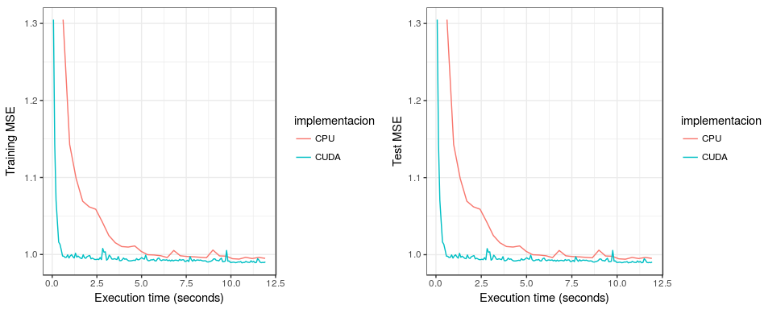
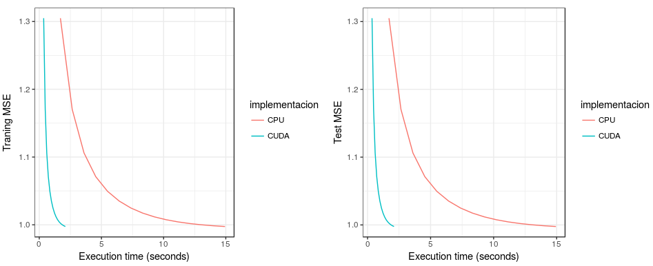
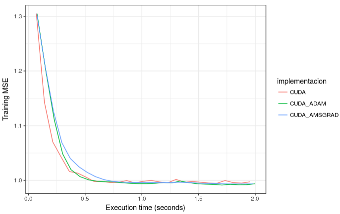

### C implementation of Stochastic Gradient Descent  

Stochastic Gradient Descent is one of the most basic algorithms in Machine Learning, it is used as a model training method which allows the model to adjust its parameters through a number of iterations. The way this works is by creating a convex cost function, then we can 'descend' through its curve until we reach the global minimum. The cost function used depends on the problem (regression vs classification, for example). However, the objetive of this project is not to explain how Gradient Descent works, especially if we can learn it straight from [Stanford](http://ufldl.stanford.edu/tutorial/supervised/OptimizationStochasticGradientDescent/).  

My objective in this project is to implement Stochastic Gradient Descent in CUDA (NVIDIA's GPGPU platform). I will implement the basic Stochastic Gradient Descent in C. Afterwards, I will implement it, along with variants such as AMSGrad and ADAM, on CUDA for computing on the GPU, and make a performance comparison between the models. Some of the operations are done with the LAPACK library (which is written in FORTRAN and runs over BLAS). Documentation on the operations that is offers can be found [here](http://www.netlib.org/lapack/explore-html/index.html).   

## Data Used  

For this project, I will be using the flights database which I found in [Kaggle](https://www.kaggle.com/usdot/flight-delays), but apparently is produced by the US Department of Transportation. This database has over 5,000,000 records, which should be useful to prove the execution different between standard sequential and when programmed on CUDA. I have modified the variables slightly to be used with these models. The original variables where these:  

`YEAR,MONTH,DAY,DAY_OF_WEEK,AIRLINE,FLIGHT_NUMBER,TAIL_NUMBER,ORIGIN_AIRPORT,DESTINATION_AIRPORT,SCHEDULED_DEPARTURE,DEPARTURE_TIME,DEPARTURE_DELAY,TAXI_OUT,WHEELS_OFF,SCHEDULED_TIME,ELAPSED_TIME,AIR_TIME,DISTANCE,WHEELS_ON,TAXI_IN,SCHEDULED_ARRIVAL,ARRIVAL_TIME,ARRIVAL_DELAY,DIVERTED,CANCELLED,CANCELLATION_REASON,AIR_SYSTEM_DELAY,SECURITY_DELAY,AIRLINE_DELAY,LATE_AIRCRAFT_DELAY,WEATHER_DELAY`  

Using a pre-processing [script](preproc_flights.sh) the data is converted to these columns:  

`"TAXI_OUT" "SCHEDULED_TIME" "ELAPSED_TIME" "AIR_TIME" "DISTANCE" "MONTH..1" "MONTH.10" "MONTH.11" "MONTH.12" "MONTH..2" "MONTH..3" "MONTH..4" "MONTH..5" "MONTH..6" "MONTH..7" "MONTH..8" "MONTH..9" "DAY_OF_WEEK.1" "DAY_OF_WEEK.2" "DAY_OF_WEEK.3" "DAY_OF_WEEK.4" "DAY_OF_WEEK.5" "DAY_OF_WEEK.6" "DAY_OF_WEEK.7" "AIRLINE.AA" "AIRLINE.AS" "AIRLINE.B6" "AIRLINE.DL" "AIRLINE.EV" "AIRLINE.F9" "AIRLINE.HA" "AIRLINE.MQ" "AIRLINE.NK" "AIRLINE.OO" "AIRLINE.UA" "AIRLINE.US" "AIRLINE.VX" "AIRLINE.WN"`  

Our objective variable, which we'll try to predict, is 'departure delay'. The columns have also been scaled for faster convergence and avoidance of numeric errors.  

## Support libraries  
Two libraries were created to support execution of this program:   
  
* definitions.h, which has the structure definitions used by the program  
  
* functions.c, which contains frequently used functions  
  
The original files which these are built upon where written by my teacher, Erick Palacios. They have suffered some modifications for the implementation of these stochastic gradient descent methods.  

### Execution  

The files to run this program are in my GitHub repository and can be downloaded in the following links:
  
* [definitions.h](definitions.h)  
  
* [functions.c](functions.c)

* [SGD_sequential.c](SGD_sequential.c)

Compile:  

```
gcc -Wall SGD_sequential.c functions.c -o sgd.out -lblas -lm
```  
The '-lblas' flag indicates we want to make BLAS (LAPACK) functions available and the '-lm' flag indicates we want the maths library available.  

This command produces a sgd.out file, which we can then run using the following command:  

```
./sgd.out 3999805 39 1714203 256 200 -0.001
```    

This is equivalent to:  
```
./sgd.out <train_rows> <columns> <validation_rows> <batch_size> <number_of_iterations> <- learning_rate>
```    

In this first attempt I ran it for 200 iterations, which took 6 minutes and 20 seconds. The evolution of the RMSE through this process is shown next:  


## GPU Implementation  

As promised, I implemented SGD, ADAM and AMSGrad on CUDA, taking advantage of the cuBLAS library, which works pretty much the same as the BLAS library, except it performs calculations on the GPU. I used the docker image provided by NVIDIA to run these programs and avoid driver issues later on. 

The code for this implementation can be seen [here](SGD_CUDA.c)

### Execution

Compile:  

```
nvcc SGD_CUDA.c functions.c -o program.out -lcublas
```  
The '-culblas' flag indicates we want to make cuBLAS functions available. I advise using the [docker image](https://hub.docker.com/r/nvidia/cuda/) provided by NVIDIA.   

This command produces a program.out file, which we can then run using the following command:  

```
./program.out <train_rows> <columns> <validation_rows> <batch_size> <number_of_iterations> <optimizer> <beta1> <beta2> <epsilon>
```   
Beta 1, Beta 2 and epsilon values are used for the ADAM and AMSGrad optimizers.

# Results

### Time to convergence

**Sequential vs CUDA - 128 batch size**  



As can be seen in the previous plot, the SGD implementation on CUDA was much faster than the sequential implementation. While the CUDA implementation took around 0.6 seconds to reach the minimum, sequential implementation took close to 6.25 seconds to reach the same point. This happens both for the train and the test set.  

**Sequential vs CUDA - batch size = all data**



A similar phenomenon happens when using all the data to calculate the gradient in each iteration. The CUDA implementation is much faster for both the training and test data sets.

**SGD, ADAM and AMSGrad comparison**



For this plot, each algorithm was trained with grid search and then manually for their different parameters. We can see that ADAM reaches the minimum faster than SGD (named CUDA in the plot) and AMSGrad, however, the difference is minimal. The use of these algorithms is not ideal for 'easy' problems like this and are more often used for problemns with multiple local minima. It would be interesting to test them for problems with these challenges.

**Next steps**

- This exercise was run using a laptop with an NVIDIA GeForce GTX 1060 card, it would be interesting to see how performance varies with other cards, for example Tesla V100 which Amazon have.
- Test with different datasets to prove implementation robustness.
- Further optimize code to speed up timing. For sections regarding calculations in ADAM and AMSGrad we transfer vectors (39 elements) back and forth from the GPU. Even though a vector of this dimension is small in size, ideally I would minimize as much data transfer between GPU and CPU as possible.